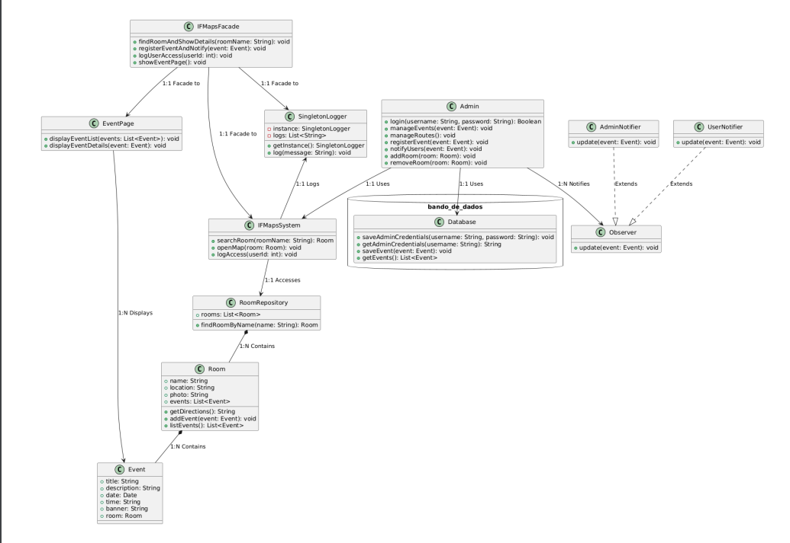

## repositorio da disicplina de Padrões
# IFMaps

## Integrantes
- [Daniel Barbosa Vasconcelos]
- [Victor José ]

## Descrição

O trabalho consiste em implementar um sistema de mapeamento de informações de IFPB campus capina grande. O sistema deve permitir a criação de mapas de informações de uma empresa, onde cada mapa é composto por nós e arestas. Cada nó representa uma informação da empresa e cada aresta representa uma relação entre duas informações. O sistema deve permitir a criação de mapas de informações de uma empresa, onde cada mapa é composto por nós e arestas.

## Padrões Utilizados

- **Singleton**: Utilizado para garantir que a classe de conexão com o banco de dados seja instanciada apenas uma vez.
- **Facede**: Utilizado para fornecer uma interface simplificada para a criação de mapas de informações.
- **Factory**: Utilizado para criar instâncias de classes de conexão com o banco de dados.
- **Strategy**: Utilizado para definir algoritmos de mapeamento de informações.
- **Observer**: Utilizado para notificar os observadores sobre a criação de um novo mapa de informações.

## Diagrama de Classes

